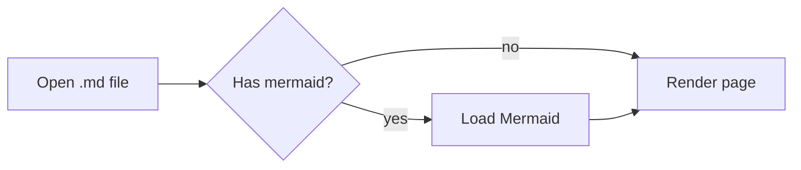
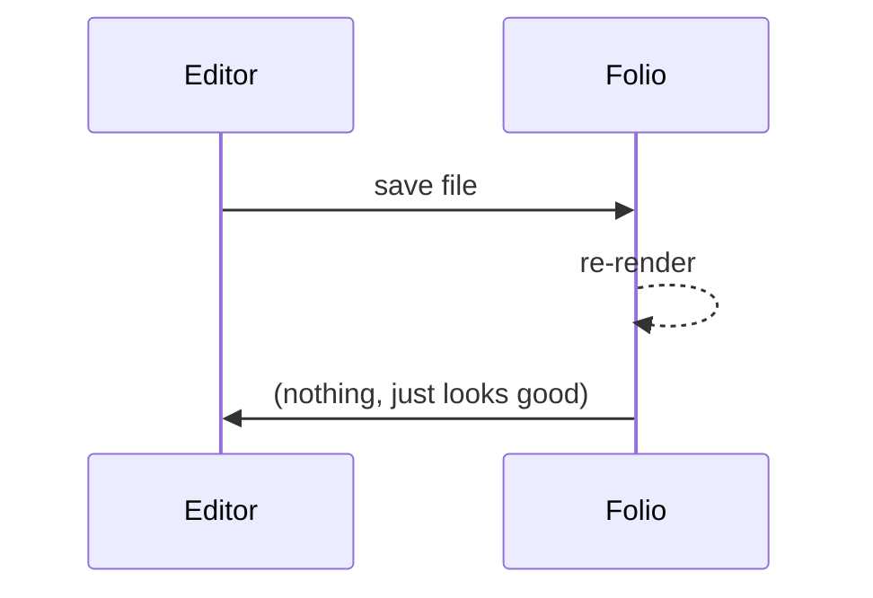
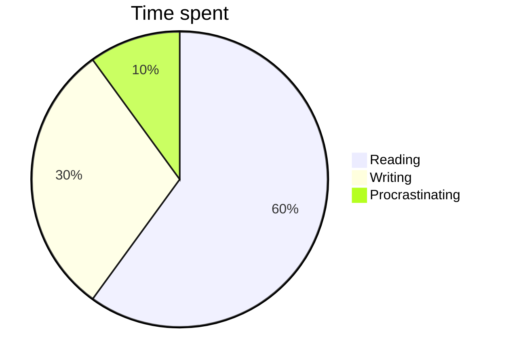

# Diagrams

## Flowchart

```mermaid
flowchart LR
    A[Open .md file] --> B{Has mermaid?}
    B -- yes --> C[Load Mermaid]
    B -- no --> D[Render page]
    C --> D
```

## Sequence

```mermaid
sequenceDiagram
    participant E as Editor
    participant F as Folio
    E->>F: save file
    F-->>F: re-render
    F->>E: (nothing, just looks good)
```

## Pie

```mermaid
pie title Time spent
    "Reading" : 60
    "Writing" : 30
    "Procrastinating" : 10
```

## Broken

```mermaid
flowchart LR
    A --> 
```
